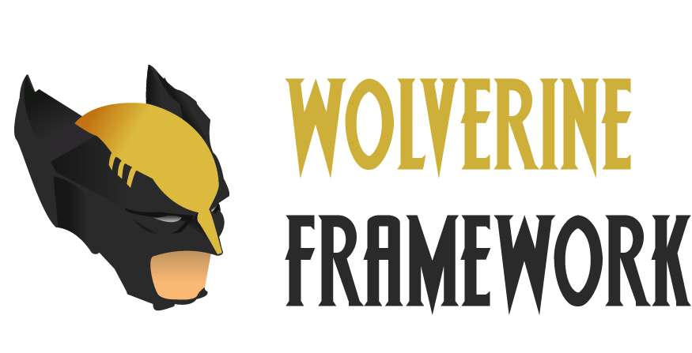

# WolverineFramework

WolverineFramework is a little and very complete Script allowing you to install and use basic Cybersecurity tools ! The Script is constantly updated, so don't forget to run the "CheckForUpdates.sh" script frequently !

# How it works ?

It's very simple, the main script "Wolverine.sh" asks you what you want to do and, depending on what you choose, it will run some "mini" script in the Script folder, in order to keep you from having to type complete commands lines.

# Tools in the Framework

  - ettercap-graphical -> Man in the Middle tool
  - hping3 -> DoS/DDoS tool
  - Medusa -> Multi purpose Bruteforce tool
  - Patator -> Multi purpose Bruteforce tool (Not available on ArchLinux)
  - Hydra -> Multi purpose Bruteforce tool
  - Network Mapper (nmap) -> Network and ports scanning tool
  - PostGreSQL -> Essential database for Metasploit
  - Metasploit -> Framework with a lot of Exploits
  - Phoneinfoga -> Tool to get informations on Intenret from a Phone Number 
  - Wordpress Security Scanner (WPScan) -> Tool to scan Wordpress Websites, to get all the extensions and so the vulnerabilities
  - MacChanger -> Tool used to hide your real MAC Address behind a fake one
  - Arp-Scan -> Tool using ARP to discover hosts inside a LAN
  - Bastet -> Tetris Clone (Not available on ArchLinux)
  - Nudoku -> Sudoku Game (Not available on ArchLinux)
  - Nsnake -> Snake Clone (Not available on ArchLinux)
  - Ninvaders -> Space Invaders Clone (not available on ArchLinux)

# How to use ?

First, I advise you to run the "ChechForUpdates.sh", it'll check if there's an update available, if it's the case, it'll ask you if you want to update to get the lastest version.

Then, I advise you to run the "Install.sh" script. For that, you have to make it executable, with the command "sudo chmod a+x CheckForUpdates.sh". This script installs every packet needed for the Framework (It'll install the packets above, if you have them, it'll do nothing), it'll also make the others script executable. 

Finally, you can run the "Wolverine.sh" script, and you just have to answer the questions to use it, it'll run the scripts from the Scripts' folder to execute what you ask !

# That's it !

Have fun with this little script, if you want to contact me, you can on Discord, Twitch or Twitter :

Discord : Théo#2226
Twitter : @LeCoqHardi__
Twitch : https://www.twitch.tv/LeCoqHardi

# Important Notes

- If you have the error "Unable to Locate package metasploit-framework", use this command -> "wget https://raw.githubusercontent.com/rapid7/metasploit-omnibus/master/config/templates/metasploit-framework-wrappers/msfupdate.erb && chmod +x msfinstall &&./msfinstall "
- Right now Patator isn't available on ArchLinux, when it is, i'll add it to the script Install_arch.sh
- All the games are not in ArchLinux, when they are, i'll add them to the script Install_arch.sh
